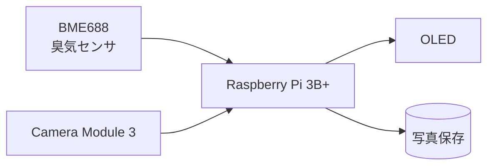
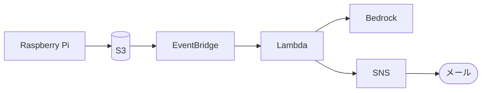

# 💩検出機器

LightningTalk（LT会）用の💩検出機器。

- **Phase1**: Raspberry Piにカメラと臭気センサを取り付け、💩を検出してOLEDに表示し、写真を撮影する
- **Phase2**: 撮影した写真をAWSに送り、AIで見た目を分類してメールで通知する

## 構成

### Phase1

臭気を検知するとカメラで撮影し、💩と判定したら写真を保存してOLEDに表示する。

### Phase2

## 技術スタック

| Phase | 内容 |
| -- | -- |
| Phase1 | Python（Raspberry Pi GPIO操作、メインプログラム） |
| Phase2 | AWS（CloudFormation）、Python（Lambda） |

## ディレクトリ構成

| パス | 概要 |
| -- | -- |
| docs/phase1/ | Phase1の設計書 |
| docs/phase2/ | Phase2の設計書 |
| src/rpi/ | Raspberry Piに格納するプログラム |
| src/infra/ | AWSのインフラ（CloudFormation） |
| src/lambda/ | Lambda関数 |

## ドキュメント

- [Phase1 設計書](docs/phase1/design.md)
- [Phase2 設計書](docs/phase2/design.md)

## ステータス

設計段階。`src/`配下は未実装。
