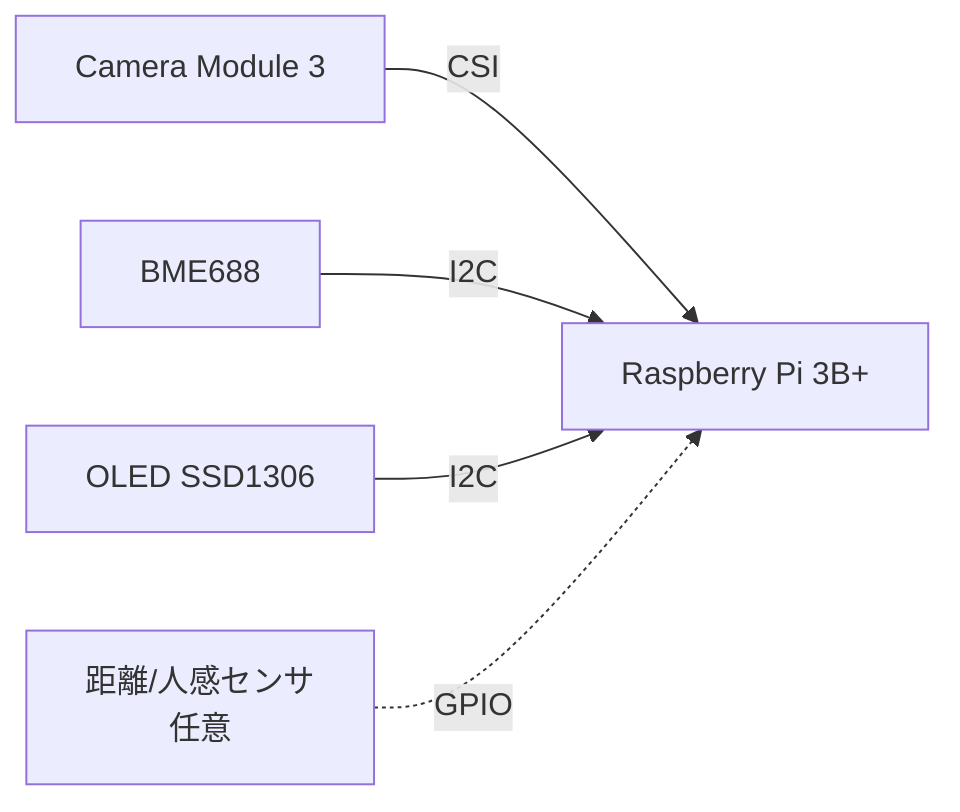
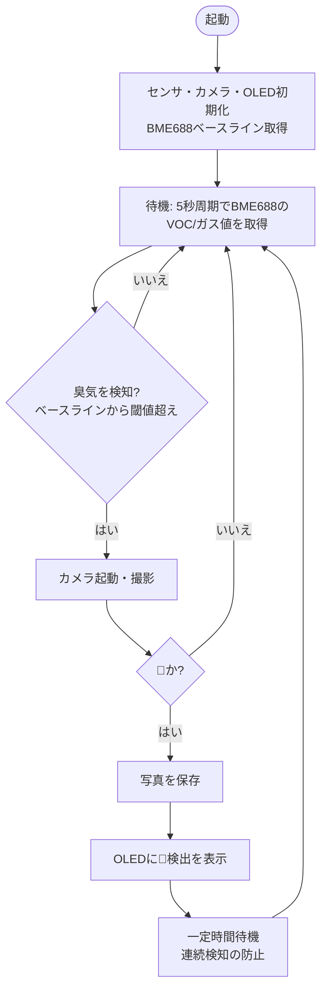

# Phase1の設計書

## 概要

💩検出アプリPhase1の設計書を記載する。

## 要件定義

### やること

- Raspberry Pi 3B+ にカメラ、臭気センサを取り付け、💩かどうか検出
- 💩だった場合はOLEDでその旨を表示
- 💩の写真を取得

### やらないこと

- AWSは作らない
- AWSに送信しない

## 機器

### 機器一覧

| 優先 | 機器 | 用途 | 目安 |
| -- | -- | -- | -- |
| ★★★ | Raspberry Pi 3B+ | 本体（メインプログラム実行） | - |
| ★★★ | Raspberry Pi Camera Module 3 | 💩画像撮影 | 数千円 |
| ★★★ | BME688搭載センサモジュール | VOC/ガス変化の取得 | 数千円 |
| ★★★ | OLEDディスプレイ（SSD1306, 0.96インチ, I2C） | 検出結果の表示 | 数百〜1,000円 |
| ★★★ | microSD 32GB程度 | Raspberry Pi OS、撮影画像の保存 | 1,000円前後 |
| ★★★ | 5V/2.5A micro-USB電源 | Pi 3B+電源 | 1,000〜2,000円 |
| ★★☆ | ジャンパ線 | BME688/OLED ↔ GPIO | 数百円 |
| ★★☆ | ブレッドボード | 配線 | 数百円 |
| ★★☆ | カメラ固定用アーム/ケース | 便器への固定 | 1,000〜2,000円 |
| ★☆☆ | 距離/人感センサ | 「使用開始」の検知（処理開始トリガ） | 数百円 |
| ★☆☆ | 温湿度センサ | 補正/ネタ増強（BME688なら基本不要） | 数百円 |

### 接続構成

| 機器 | 接続先 | インターフェース |
| -- | -- | -- |
| Camera Module 3 | CSIコネクタ | CSI（フラットケーブル） |
| BME688 | GPIO（3.3V, GND, SDA, SCL） | I2C |
| OLED (SSD1306) | GPIO（3.3V, GND, SDA, SCL） | I2C |
| 距離/人感センサ（任意） | GPIO（デジタル入力） | GPIO |

- BME688とOLEDはI2Cバスを共有する（アドレスが異なるため同一バスで接続可能。BME688: 0x76/0x77、SSD1306: 0x3C/0x3D）
- I2Cは`raspi-config`で有効化する
- センサ類は3.3V駆動とする（5Vを供給しない）

## 処理フロー

### 全体フロー

### 各ステップの詳細

| # | ステップ | 内容 |
| -- | -- | -- |
| 1 | 初期化 | 各デバイスを初期化し、BME688のベースライン（通常時のガス抵抗値）と、空の便器のベースライン画像を取得する |
| 2 | 臭気検知 | BME688のガス抵抗値を5秒周期で取得し、ベースラインからの変化が閾値を超えたら検知とする |
| 3 | 撮影 | 臭気検知をトリガにカメラを起動して撮影する |
| 4 | 💩判定 | OpenCVで撮影画像から💩かどうかを判定する（詳細は下記「💩判定方式」参照） |
| 5 | 写真保存 | 💩と判定した場合、タイムスタンプ付きのファイル名でmicroSDに保存する |
| 6 | OLED表示 | 💩検出の旨をOLEDに表示する |
| 7 | クールダウン | 連続検知を避けるため一定時間は再検知しない。その後待機に戻る |

- 判定は5秒周期のループで繰り返す（1周期＝ガス取得→臭気検知→撮影→💩判定）。撮影と判定は5秒以内に完了させる
- 💩でないと判定した場合は何も表示・保存せず、待機に戻る
- 距離/人感センサを追加する場合は、待機中の臭気検知の前段に「使用開始の検知」を入れ、それをトリガに臭気の計測を始める

## 💩判定方式

OpenCVによる簡易判定とする（学習モデルは使わない）。カメラは便器に固定する前提。

1. 判定範囲（ROI）を固定する
2. 初期化時に撮影した空の便器のベースライン画像と、撮影画像の差分を取り、変化した領域を抽出する
3. 変化領域のうち、HSVで茶〜黄土色の画素が一定割合以上なら💩と判定する

- 誤検出が多い場合は、軽量分類モデル（TFLite等）への切り替えを検討する
- Phase2ではBedrockが「💩が写っていない画像」を判別できるため、Phase1の判定は取りこぼしを減らす方向（緩め）でよい

## 未決事項

- 💩判定のHSV範囲、変化領域の面積・割合の閾値、ROI
- 臭気検知の閾値、クールダウン時間
- OLEDの表示内容（文言・アイコン、表示時間）
- 撮影画像の保存先ディレクトリと保持方針
