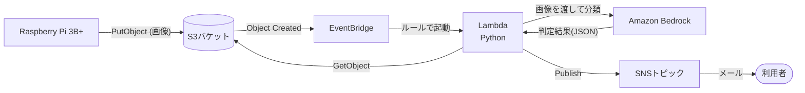
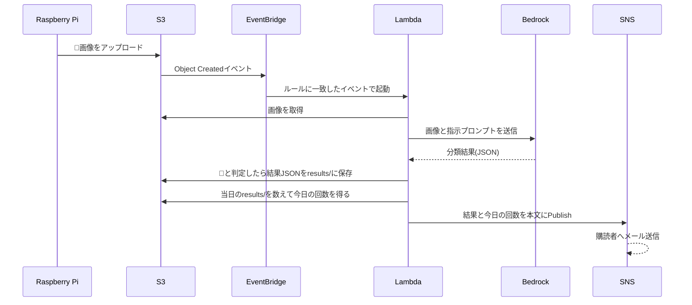

# Phase2の設計書

## 概要

💩検出アプリPhase2の設計書を記載する。
Phase1で撮影した💩の写真をAWSに送信し、AIで見た目を分類（LT向けの簡易判定）して、結果をメールで通知する。

## 要件定義

### やること

- Raspberry PiからS3に💩の写真をアップロードする
- S3へのアップロードをEventBridge経由でLambdaに通知する
- Lambda内でAIを使用し、画像から見た目（状態・量・色）を分類する
- 判定結果をSNSでメール送信する
- 「今日の💩回数」を集計し、メールに載せる（S3のキー（日付入り）から数える）
- AWSリソースはCloudFormationで定義する

### やらないこと

- DynamoDBなどのDBの利用
- 結果の可視化（ダッシュボード等）
- 医療的な診断（あくまでLT会向けのネタ・参考情報として扱う）

## 構成

### 使用サービス

| サービス | 用途 |
| -- | -- |
| S3 | 💩画像・判定結果の保存、イベント発生元、回数集計の元データ |
| EventBridge | S3のオブジェクト作成イベントを受けてLambdaを起動 |
| Lambda (Python) | 画像取得、AI呼び出し、通知メッセージ組み立て |
| Amazon Bedrock | 画像から見た目を分類するAI（Amazon Nova Pro。学習不要） |
| SNS | 判定結果のメール送信 |
| IAM | RPi用の最小権限、Lambda実行ロール |

### 構成図



## 処理フロー

### 全体フロー



### 各ステップの詳細

| # | ステップ | 内容 |
| -- | -- | -- |
| 1 | アップロード | Phase1で💩を検出して保存した写真を、RPiからS3にアップロードする |
| 2 | イベント通知 | S3のEventBridge通知を有効化し、`Object Created`イベントをデフォルトバスに流す |
| 3 | Lambda起動 | EventBridgeルールで対象バケット・プレフィックスのイベントのみLambdaに渡す |
| 4 | 画像取得 | イベントのバケット名・キーから画像を取得する |
| 5 | AI判定 | 画像をBedrockのNova Proに渡し、見た目の分類結果（JSON）を得る |
| 6 | 結果保存・回数集計 | 💩と判定した場合、結果JSONを`results/`に保存し、当日分のオブジェクト数を数えて「今日の回数」とする |
| 7 | メール送信 | 判定結果、今日の回数、撮影日時、画像のS3キーを本文にしてSNSにPublishする |

## 詳細設計

### RPi側（src/rpi/）

- Phase1の「写真保存」の後に、S3アップロード処理を追加する
- アップロード先キー: `images/YYYY/MM/DD/YYYYMMDD-HHMMSS.jpg`（日付はRPiのローカル時刻。RPiのタイムゾーンをJSTにしておく）
- 認証: RPi専用のIAMユーザー（`s3:PutObject`を対象バケットの`images/`配下のみに許可）のアクセスキーをRPi上に配置する
- アップロード失敗時は写真をmicroSDに残し、次回起動時等に再送する
- Phase1の「AWSに送信しない」はPhase2で解除する

### S3

- バケットは非公開（パブリックアクセスブロック有効）
- EventBridge通知を有効化する
- 画像・判定結果は削除せず保持する（LT用途のため、削除処理・ライフサイクルは設定しない）
- 判定結果は`results/YYYY/MM/DD/YYYYMMDD-HHMMSS.json`に保存する（`images/`と同じ日付部分のキー）。EventBridgeの対象は`images/`のみなので、結果の保存でLambdaが再起動することはない

### EventBridge

- イベントパターン（イメージ）:

```json
{
  "source": ["aws.s3"],
  "detail-type": ["Object Created"],
  "detail": {
    "bucket": { "name": ["<バケット名>"] },
    "object": { "key": [{ "prefix": "images/" }] }
  }
}
```

### Lambda（src/lambda/）

- ランタイム: Python
- 環境変数: `TOPIC_ARN`、`MODEL_ID`
- 実行ロール権限: 対象バケットへの`s3:GetObject`（`images/`）、`s3:PutObject`（`results/`）、`s3:ListBucket`（`results/`）、`bedrock:InvokeModel`、`sns:Publish`、CloudWatch Logs出力
- 今日の回数の集計:
  - 「今日」はLambdaの実行時刻ではなく、**画像キーの日付部分（YYYY/MM/DD）**から決める（LambdaはUTCのため、JSTの日付とずれるのを避ける）
  - `detected`がtrueで「判定不能」でない場合のみ、結果JSONを`results/YYYY/MM/DD/`に保存する
  - 保存後に`results/YYYY/MM/DD/`をListして件数を数え、今回の分を含めた回数とする
  - 結果のキーは画像のキーから決まるため、Lambdaが再試行されても二重に数えない
  - 回数は「検出（写真）の件数」であり、Phase1のクールダウン時間の設定に依存する
- AIへの指示は下記「AI判定」に従う
- AIの応答（JSON）をパースし、メール本文を組み立ててSNSにPublishする
- JSONのパースに失敗した場合、または`confidence`が低い場合は「判定不能」として通知する
- AIの呼び出しが失敗した場合は例外を送出し、Lambdaの再試行とDLQ（任意）に任せる

### AI判定

これは医療診断ではなく、**画像からのLT向けの見た目判定**である。学習は行わず、マルチモーダルAI（Amazon Nova Pro）に画像を渡して、固定の選択肢へ分類させる。

| 項目 | 出力値 | 判定の考え方 |
| -- | -- | -- |
| detected | `true / false` | 💩が写っているか |
| consistency（状態） | `normal / soft / watery / unknown` | 見た目から簡易分類 |
| amount（量） | `small / medium / large / unknown` | 便器内で占める面積から概算 |
| color（色） | `brown / dark / yellowish / reddish / other / unknown` | 見た目の色を分類 |
| health_indicator（健康の目安） | `looks_normal / attention / unknown` | 状態・色などから、医療診断ではない見た目上の目安を示す |
| confidence（信頼度） | `0.0〜1.0` | 低い場合は「判定不能」にする |
| reason | 短い文字列 | 判定理由の短い説明 |

プロンプト（イメージ）:

```
これは固定カメラで撮影した便器内の画像です。
医療診断は行わず、見た目の簡易分類だけをしてください。
以下のJSONだけを返してください。

{
  "detected": true,
  "consistency": "normal|soft|watery|unknown",
  "amount": "small|medium|large|unknown",
  "color": "brown|dark|yellowish|reddish|other|unknown",
  "health_indicator": "looks_normal|attention|unknown",
  "confidence": 0.0,
  "reason": "短い説明"
}

画像が不鮮明、反射が強い、対象が見えない場合は unknown を選んでください。
health_indicator は医療診断ではありません。見た目が一般的な範囲に見える場合だけ
looks_normal、状態や色から気になる見た目がある場合は attention、それ以外は unknown を選んでください。
```

- 量・色は、照明、水面の反射、カメラ位置に大きく左右される
- 安定させるため、固定照明・固定カメラにし、白い基準色カードを置く
- Nova Liteでも画像入力は可能で、コスト・速度を優先する場合の代替とする。デモの判定品質を優先してProを使う
- Rekognitionの通常のラベル検出では便の性状分類は期待できない。Custom Labelsは画像のラベル付けと学習が必要なため、今回は採用しない

### SNS

- 標準トピックにメールプロトコルで購読者を登録する（購読の承認が必要）
- メール本文の例:

```
件名: 💩を検出しました — 健康の目安: おおむね問題なさそう（今日3回目）
本文:
検出日時: 2026-09-29 12:34:56
今日の回数: 3回

健康の目安: おおむね問題なさそう
  （画像上は一般的な範囲の見た目です）

見た目の詳細:
  状態: normal / 量: medium / 色: brown
  判定信頼度: 0.82
  理由: <AIによる短い説明>

画像: s3://<バケット名>/images/2026/09/29/20260929-123456.jpg
※ これは画像からのLT向け簡易判定であり、医療診断ではありません。
   体調に不安がある場合は、AIの結果にかかわらず医療機関へ相談してください。
```

### インフラ（src/infra/）

CloudFormationで以下を定義する。

- S3バケット（EventBridge通知有効、ライフサイクル、パブリックアクセスブロック）
- RPi用IAMユーザーとポリシー
- EventBridgeルール、Lambdaへのターゲットと呼び出し権限
- Lambda関数と実行ロール
- SNSトピックとメール購読（メールアドレスはパラメータ化）

### 既知の限界

- Phase1の匂いセンサーは1つだけであり、取得できるのは単一のガス反応値である。匂いの成分を識別できないため、この値だけから健康状態を推定することはできない。
- 匂いセンサー値は温度・湿度、芳香剤、洗剤、食べ物などの影響を受け、💩以外にも反応する可能性がある。
- 将来的に匂いを健康状態の参考情報へ活用するには、硫化水素・アンモニア・VOCなど反応特性が異なる複数センサー、温湿度による補正、個人ごとの時系列データが必要になる。
- Phase2で扱う匂いセンサー値は、検出時の補助情報にとどめ、健康の目安を出す根拠には用いない。

## 未決事項

- Nova Proの東京リージョンでの利用方法（直接呼び出しか、クロスリージョン推論プロファイル経由か）と、モデルアクセスの有効化
- 「判定不能」とする`confidence`の閾値
- RPiの認証方式（IAMユーザーのアクセスキーか、IAM Roles Anywhereか）
- SNSメールの宛先人数
- 💩でない画像がアップロードされた場合の扱い（通知するか、破棄するか）
