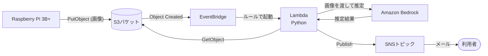
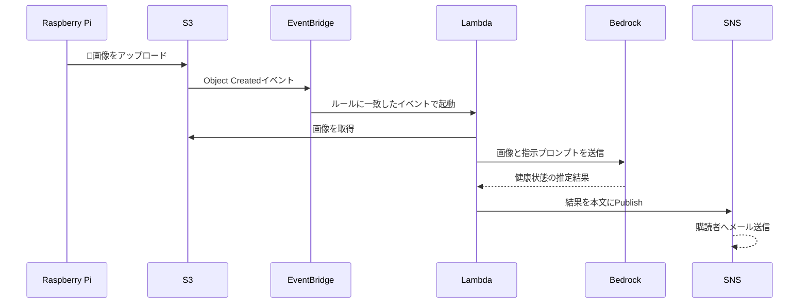

# Phase2の設計書

## 概要

💩検出アプリPhase2の設計書を記載する。
Phase1で撮影した💩の写真をAWSに送信し、AIで健康状態を推定して、結果をメールで通知する。

## 要件定義

### やること

- Raspberry PiからS3に💩の写真をアップロードする
- S3へのアップロードをEventBridge経由でLambdaに通知する
- Lambda内でAIを使用し、画像から健康状態を推定する
- 推定結果をSNSでメール送信する
- AWSリソースはCloudFormationで定義する

### やらないこと

- 推定結果の蓄積・可視化（ダッシュボード等）
- 医療的な診断（あくまでLT会向けのネタ・参考情報として扱う）

## 構成

### 使用サービス

| サービス | 用途 |
| -- | -- |
| S3 | 💩画像の保存、イベント発生元 |
| EventBridge | S3のオブジェクト作成イベントを受けてLambdaを起動 |
| Lambda (Python) | 画像取得、AI呼び出し、通知メッセージ組み立て |
| Amazon Bedrock | 画像から健康状態を推定するAI（マルチモーダルモデル） |
| SNS | 推定結果のメール送信 |
| IAM | RPi用の最小権限、Lambda実行ロール |

### 構成図



## 処理フロー

### 全体フロー



### 各ステップの詳細

| # | ステップ | 内容 |
| -- | -- | -- |
| 1 | アップロード | Phase1で💩を検出して保存した写真を、RPiからS3にアップロードする |
| 2 | イベント通知 | S3のEventBridge通知を有効化し、`Object Created`イベントをデフォルトバスに流す |
| 3 | Lambda起動 | EventBridgeルールで対象バケット・プレフィックスのイベントのみLambdaに渡す |
| 4 | 画像取得 | イベントのバケット名・キーから画像を取得する |
| 5 | AI推定 | 画像をBedrockのマルチモーダルモデルに渡し、健康状態の推定結果を得る |
| 6 | メール送信 | 推定結果、撮影日時、画像のS3キーを本文にしてSNSにPublishする |

## 詳細設計

### RPi側（src/rpi/）

- Phase1の「写真保存」の後に、S3アップロード処理を追加する
- アップロード先キー: `images/YYYY/MM/DD/YYYYMMDD-HHMMSS.jpg`
- 認証: RPi専用のIAMユーザー（`s3:PutObject`を対象バケットの`images/`配下のみに許可）のアクセスキーをRPi上に配置する
- アップロード失敗時は写真をmicroSDに残し、次回起動時等に再送する
- Phase1の「AWSに送信しない」はPhase2で解除する

### S3

- バケットは非公開（パブリックアクセスブロック有効）
- EventBridge通知を有効化する
- 画像は一定期間（例: 30日）でライフサイクル削除する

### EventBridge

- イベントパターン（イメージ）:

```json
{
  "source": ["aws.s3"],
  "detail-type": ["Object Created"],
  "detail": {
    "bucket": { "name": ["<バケット名>"] },
    "object": { "key": [{ "prefix": "images/" }] }
  }
}
```

### Lambda（src/lambda/）

- ランタイム: Python
- 環境変数: `TOPIC_ARN`、`MODEL_ID`
- 実行ロール権限: 対象バケットへの`s3:GetObject`、`bedrock:InvokeModel`、`sns:Publish`、CloudWatch Logs出力
- プロンプト方針:
  - 画像から💩の色・形状・硬さ等の特徴を読み取らせ、健康状態を推定させる
  - あくまで参考情報である旨と、ユーモアを交えた短い文面で出力させる
  - 💩が写っていない画像だった場合はその旨を返させる
- AIの呼び出しが失敗した場合は例外を送出し、Lambdaの再試行とDLQ（任意）に任せる

### SNS

- 標準トピックにメールプロトコルで購読者を登録する（購読の承認が必要）
- メール本文の例:

```
件名: 💩を検出しました
本文:
検出日時: 2026-09-29 12:34:56
画像: s3://<バケット名>/images/2026/09/29/20260929-123456.jpg
推定結果:
  <AIによる健康状態の推定>
※ 本結果は医療的な診断ではありません
```

### インフラ（src/infra/）

CloudFormationで以下を定義する。

- S3バケット（EventBridge通知有効、ライフサイクル、パブリックアクセスブロック）
- RPi用IAMユーザーとポリシー
- EventBridgeルール、Lambdaへのターゲットと呼び出し権限
- Lambda関数と実行ロール
- SNSトピックとメール購読（メールアドレスはパラメータ化）

## 未決事項

- 使用するBedrockのモデル（画像入力対応モデルの選定、リージョンでの利用可否）
- RPiの認証方式（IAMユーザーのアクセスキーか、IAM Roles Anywhereか）
- 画像の保持期間
- メール本文の文面、宛先の人数
- 💩でない画像がアップロードされた場合の扱い（通知するか、破棄するか）
